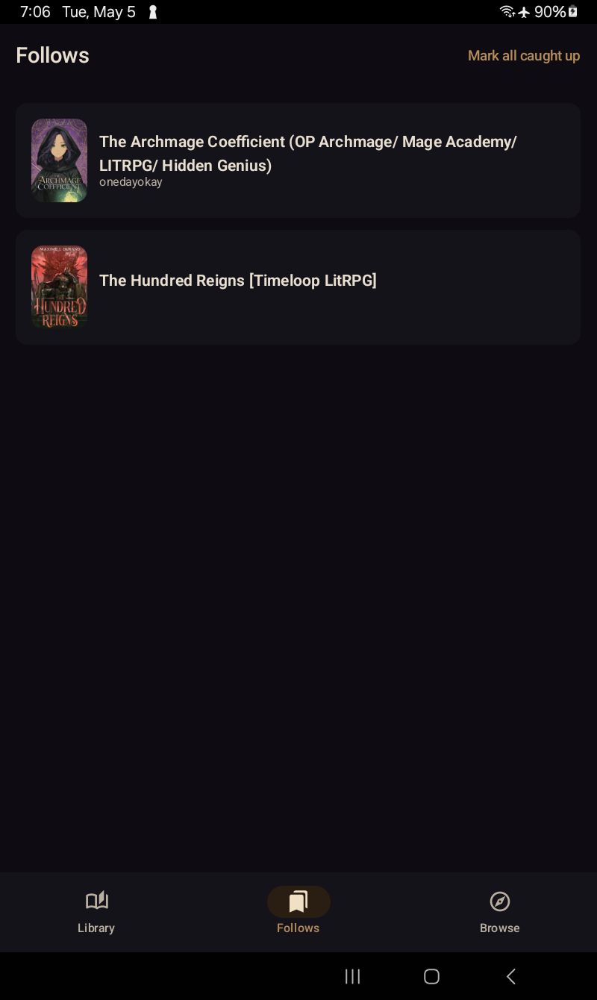
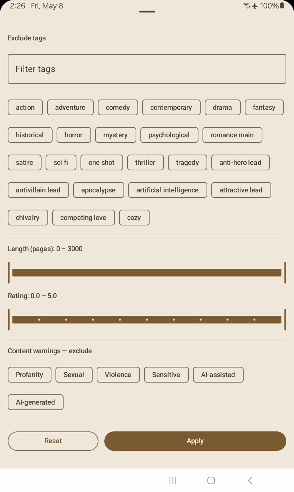
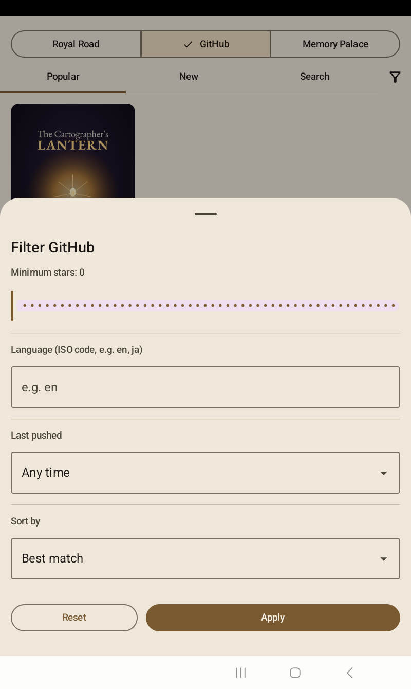

# storyvox

[](https://github.com/jphein/storyvox/actions/workflows/android.yml)
[](https://github.com/jphein/storyvox/releases)
[](LICENSE)
[](#how-it-was-built)

**A neural-voice audiobook player for serial fiction.**
Stream chapters from [Royal Road](https://royalroad.com) and [GitHub](https://github.com/), read aloud by an offline neural TTS engine. A hybrid reader/audiobook view highlights the spoken sentence in brass as you listen. Built for Android phones, tablets, and Wear OS.

<p align="center">
  
</p>

> **v0.4.31** — engine stable, PCM cache filesystem layer landed, performance modes shipping, voice tiers + favorites in the picker. GPL-3.0 (downstream of the engine, not a posture choice — see [License](#license)).

---

## What it does

- **Two fiction sources, side by side.** Browse [Royal Road](https://royalroad.com) with the full filter set (tags include/exclude, status, type, length, rating, content warnings, sort) or browse fiction repos on GitHub via the curated [storyvox-registry](https://github.com/jphein/storyvox-registry) plus live `/search/repositories` results.
- **Plays chapters as audiobooks** through an in-process neural TTS engine. Two voice families ship: [Piper](https://github.com/rhasspy/piper) (compact, ~14–30 MB) and [Kokoro](https://github.com/hexgrad/kokoro) (multi-speaker, ~330 MB). Voice models download on demand from `voices-v2`; nothing is bundled in the APK. No cloud, no API keys, no per-character billing.
- **Highlights the current sentence** in brass as the engine speaks. Swipe between audiobook view (cover, scrubber, transport) and reader view (chapter text). The highlight glides between sentences to match the read-aloud rhythm.
- **Auto-advances** between chapters. Eager-downloads ahead so the next chapter is ready when the current ends. PCM cache buffering keeps playback smooth when synthesis falls behind — the player pauses, refills, resumes without a glitch.
- **Voice library with tiers and favorites.** Engine-grouped picker, star toggles for the voices you keep coming back to, and a Starred surface that floats them to the top.
- **Sleep timer** with 15/30/45/60-minute presets, an "end of chapter" mode, and a countdown pulse as time runs out.
- **Library + Follows tabs** with sign-in via WebView (your Royal Road follow list syncs into the app).
- **Infinite-scroll Browse** across every tab.
- **Cheap polling for new chapters.** GitHub-sourced fictions watch the repo's HEAD SHA; the manifest is only re-scanned when something changes — one HTTP request per fiction per check.
- **MediaSession-aware** — lock-screen art, transport from Bluetooth headsets, headphone media buttons, notification shade.
- **Library Nocturne theme** — brass on warm dark, EB Garamond chapter body, Inter UI. Light mode is parchment cream.
- **Adaptive layouts** — fills the screen on phones (2 columns), tablets (5), foldables (more).

## Screens

<table>
<tr>
<td align="center"><b>Browse</b><br/></td>
<td align="center"><b>Fiction detail</b><br/></td>
<td align="center"><b>Reader / audiobook</b><br/></td>
</tr>
<tr>
<td align="center"><b>Library</b><br/></td>
<td align="center"><b>Follows</b><br/></td>
<td align="center"><b>Settings</b><br/></td>
</tr>
<tr>
<td align="center"><b>Royal Road filters</b><br/></td>
<td align="center"><b>GitHub filters</b><br/></td>
<td></td>
</tr>
</table>

## TTS engine

storyvox links the TTS engine in-process via the [VoxSherpa-TTS](https://github.com/jphein/VoxSherpa-TTS) `:engine-lib` AAR (published to JitPack). That AAR re-projects [k2-fsa/sherpa-onnx](https://github.com/k2-fsa/sherpa-onnx) inference plus the Piper and Kokoro wrappers into a single dependency. We bypass Android's `TextToSpeech` framework entirely, manage our own `AudioTrack` with a fat buffer, and pipeline next-sentence generation against current playback. No second APK, no install gate, no engine-binding handshake — synthesis runs in storyvox's own process.

Voice model weights are downloaded on demand by `VoiceManager` from the `voices-v2` GitHub release; the in-app picker shows what's installed and what's available. See [`docs/VOICES.md`](docs/VOICES.md) for the catalog and refresh workflow.

## Install (sideload)

storyvox is currently distributed by sideloading. CI builds debug APKs on every `main` push; tagged releases (`v0.x.x`) attach a signed APK to the GitHub release.

1. Download the latest `storyvox.apk` from the [Releases page](https://github.com/jphein/storyvox/releases).
2. On your Android device, enable **Install unknown apps** for whatever browser/file manager you used.
3. Open the APK to install.
4. Launch storyvox. You'll be asked for notification permission (used for the lock-screen tile during playback). The voice picker appears on first launch — pick a Piper voice for a quick first chapter (~14–30 MB) or Kokoro for the multi-speaker model (~330 MB).

System requirements:

- Android 8.0 (API 26) or higher
- ~50 MB free storage for the APK; voice models add 14 MB to ~330 MB
- An internet connection for browsing, chapter download, and the first-time voice download (chapters and voices cache locally)

## Optional: sign in to Royal Road

Anonymous browsing works for all public chapters. **Sign in** unlocks:

- Premium chapters (Patreon-tier early access)
- Your Follows tab — your bookmarked fictions sync down

storyvox uses an in-app WebView for the login flow. Your password never touches our code; only the session cookies are captured (and stored encrypted on-device).

## Build from source

Requires JDK 17, Android SDK 35, and a system gradle ≥ 8.10 for the wrapper bootstrap.

```sh
git clone https://github.com/jphein/storyvox.git
cd storyvox

# One-time bootstrap
gradle wrapper --gradle-version 8.10 --distribution-type bin
echo "sdk.dir=$ANDROID_HOME" > local.properties

# Build
./gradlew :app:assembleDebug          # phone APK
./gradlew :wear:assembleDebug         # wear APK
./gradlew :app:installDebug           # install on connected device
```

The CI workflow (`.github/workflows/android.yml`) shows the canonical build steps.

## Architecture

```
┌─────────────────────────────────────────────┐
│  :app                                       │
│  Hilt root · NavHost · Settings adapters    │
└──────┬──────────────┬───────────────────────┘
       │              │
       │              ▼
       │       ┌──────────────────────┐
       │       │  :feature            │
       │       │  Library / Follows / │
       │       │  Browse / Reader /   │
       │       │  Detail / Settings   │
       │       └──────┬─────┬─────────┘
       │              │     │
       ▼              ▼     ▼
┌────────────┐  ┌─────────────────┐  ┌───────────────┐
│ :core-data │  │ :core-playback  │  │  :core-ui     │
│  Room +    │  │  EnginePlayer + │  │  Library      │
│  repos +   │  │  PcmSource +    │  │  Nocturne     │
│  Fiction   │  │  VoiceManager + │  │  theme +      │
│  Source    │  │  SentenceTracker│  │  components   │
│  Map       │  │  (in-proc TTS)  │  │               │
└─────┬──────┘  └────────┬────────┘  └───────────────┘
      │                  │
      ▼                  │ JitPack: VoxSherpa-TTS :engine-lib
┌──────────────────────┐ │ (Piper + Kokoro + sherpa-onnx)
│ :source-royalroad    │ │
│  Cloudflare-aware    │ │
│  fetch, parsers,     │ │
│  login WebView,      │ │
│  honeypot filter     │ │
└──────────────────────┘ │
┌──────────────────────┐ │
│ :source-github       │ │
│  GitHub API client,  │ │
│  book.toml +         │ │
│  storyvox.json,      │ │
│  commonmark renderer │ │
└──────────────────────┘ │
                         ▼
                   (audio out)
```

Eight Gradle modules. Sources implement an interface declared in `:core-data` and bind into `Map<String, FictionSource>` via Hilt `@IntoMap @StringKey`. The playback layer is independent of the UI; the engine library is a single transitive dep on `:core-playback`.

Design specs (each shipped or in flight) read as a thread:

- [Storyvox baseline](docs/superpowers/specs/2026-05-05-storyvox-design.md) — original architecture
- [GitHub source](docs/superpowers/specs/2026-05-06-github-source-design.md) — second fiction source
- [PCM cache](docs/superpowers/specs/2026-05-07-pcm-cache-design.md) — render-to-disk for slow-voice gapless playback
- [VoxSherpa knobs](docs/superpowers/specs/2026-05-08-voxsherpa-knobs-research.md) — engine settings catalog
- [Settings redesign](docs/superpowers/specs/2026-05-08-settings-redesign-design.md) — grouped-card structure
- [Azure HD voices](docs/superpowers/specs/2026-05-08-azure-hd-voices-design.md) — BYOK cloud TTS
- [GitHub OAuth](docs/superpowers/specs/2026-05-08-github-oauth-design.md) — your private repos as fictions

Per-dreamer detail specs live in `scratch/dreamers/`.

## Stack

| | |
|---|---|
| Language | Kotlin 2.0 |
| UI | Jetpack Compose, Material 3 |
| DI | Hilt (KSP) |
| Storage | Room, DataStore Preferences, EncryptedSharedPreferences |
| Networking | OkHttp + Jsoup (RR is HTML, not JSON) + commonmark (GitHub markdown) |
| Playback | Media3 SimpleBasePlayer + custom AudioTrack pipeline |
| TTS | VoxSherpa-TTS engine-lib (Piper + Kokoro on sherpa-onnx) — in-process |
| Async | Coroutines + Flow |
| Wear OS | Compose for Wear, `play-services-wearable` |
| CI | GitHub Actions |

## Roadmap

The engine is stable. The next wave is structural fixes for slow-voice quality, settings polish, and new fiction sources.

- **PCM cache rollout (PRs C–H).** The filesystem layer landed in [#100](https://github.com/jphein/storyvox/pull/100); the remaining steps wire auto-population on add-fiction, settings UI for cache size and eviction, and graceful fallback when the cache is incomplete. End state: high-quality voices play gaplessly on the Tab A7 Lite class. Spec: [PCM cache](docs/superpowers/specs/2026-05-07-pcm-cache-design.md).
- **Settings redesign.** Six grouped cards, five reusable row composables, brass containment. Indigo's spec landed; Saga is implementing structural-only — every existing knob's behavior preserved bit-for-bit. Spec: [Settings redesign](docs/superpowers/specs/2026-05-08-settings-redesign-design.md).
- **VoxSherpa knobs.** Per-voice speed/pitch overrides, sentence-silence tuning, decoder choice. Catalog complete; JP triages which knobs ship. Spec: [VoxSherpa knobs](docs/superpowers/specs/2026-05-08-voxsherpa-knobs-research.md).
- **Azure HD voices (BYOK).** Cloud TTS for premium quality on slow devices. Bring-your-own Azure Speech key, sentence-keyed SSML synthesis, drops into the existing PCM cache like a local voice. Spec: [Azure HD voices](docs/superpowers/specs/2026-05-08-azure-hd-voices-design.md).
- **GitHub OAuth (Device Flow).** Optional sign-in unlocks your private repos, starred lists, and gists as fiction sources, plus a 5,000 req/hr ceiling. Smallest-scope first; private-repo access is a separate toggle. Spec: [GitHub OAuth](docs/superpowers/specs/2026-05-08-github-oauth-design.md).
- **AI integration.** Multi-provider chat (Claude, Ollama, others) wired via [cloud-chat-assistant](https://github.com/jphein/cloud-chat-assistant) — summaries, character glossaries, "what did I miss?" recaps when you pick a fiction back up.
- **Memory Palace as fiction source.** Read your own knowledge palace as serial fiction — diary entries and knowledge-graph timelines render as chapters.

See [`docs/ROADMAP.md`](docs/ROADMAP.md) for the long-form roadmap and backlog.

## How it was built

storyvox was built starting May 5, 2026 by JP Hein orchestrating teams of dream-named [Claude Opus](https://www.anthropic.com/claude) agents working in parallel via [Claude Code](https://www.anthropic.com/claude-code). The original five-act structure shipped the v0.3 line:

1. **storyvox-dreamers** — Morpheus, Selene, Oneiros, Hypnos, Aurora drafted the architecture, data layer, Royal Road integration, playback engine, and design system.
2. **storyvox-tonight** — Phantasos, Morrigan, Caelus wired live audio playback, library round-trip, and loading skeletons.
3. **storyvox-finish** — Iris, Aether, Pheme, Janus added the sentence-highlight reader, player polish (speed/sleep/voice), MediaStyle notification, and CI/CD.
4. **storyvox-features-2** — Athena, Themis, Hestia shipped sign-in, full RR filters, and responsive grids.
5. **Davis** orchestrated all four teams, integrated their work, verified on a Galaxy Tab A7 Lite, committed and pushed.

The v0.4 line landed the in-process VoxSherpa engine, voice library, GitHub fiction source, infinite-scroll browse, motion polish, and the PCM cache filesystem layer. Aurelia owned the perf lane and benched Piper-high "cori" at 0.285× realtime on the target device — the number that justifies the cache work. Bryn shipped Performance Mode A/B toggles. The voice picker grew tiers, stars, and a Starred surface.

The May 8 round was the largest single-day landing yet — 30+ agents in parallel under JP's orchestration. Indigo specced the Settings redesign; Saga is implementing it. Solara specced Azure HD; Ember specced GitHub OAuth; Thalia catalogued every VoxSherpa knob worth exposing. Iris refreshed the README and clarified the GPL-3.0 license posture (downstream obligation, not branding). Calliope chased an auth-cookie race. Briar polished the README you're reading.

Each commit message preserves who did what — `git log` reads as a team retro.

## License

storyvox is licensed under the [GNU General Public License v3.0](LICENSE).

We statically link [VoxSherpa-TTS](https://github.com/jphein/VoxSherpa-TTS) (GPL-3.0) into the APK as our TTS engine. The combined work is therefore GPL-3.0 — this license is not a posture choice, it's a downstream obligation. Relicensing more permissively would require replacing the engine, not just changing this file.

You're free to use, modify, and redistribute under the terms of the GPL-3.0.
