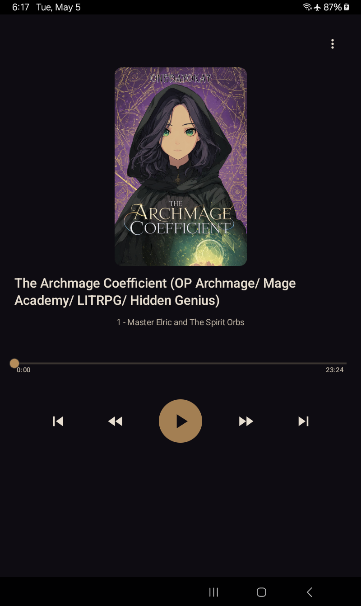
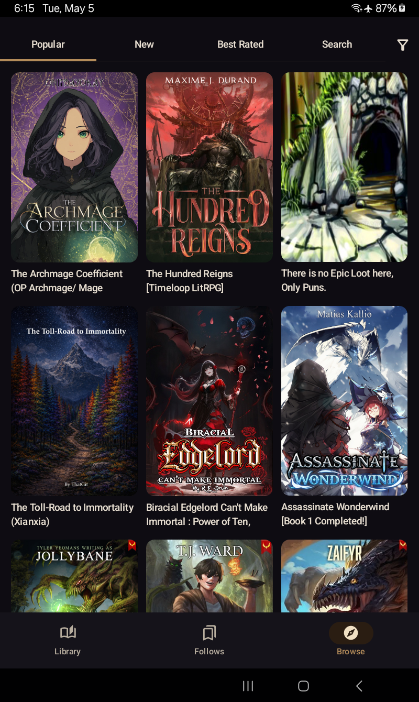
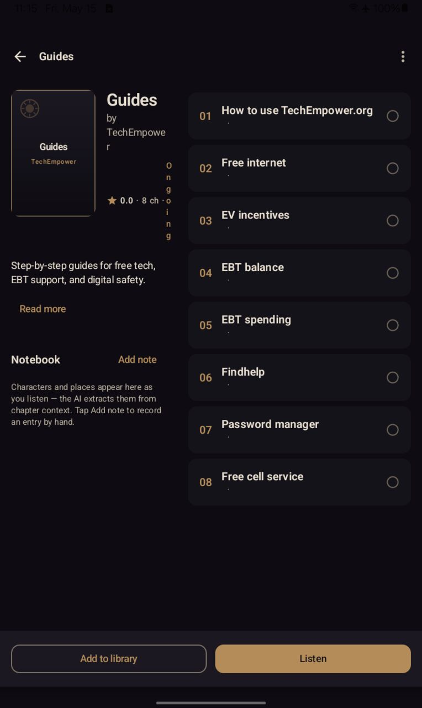
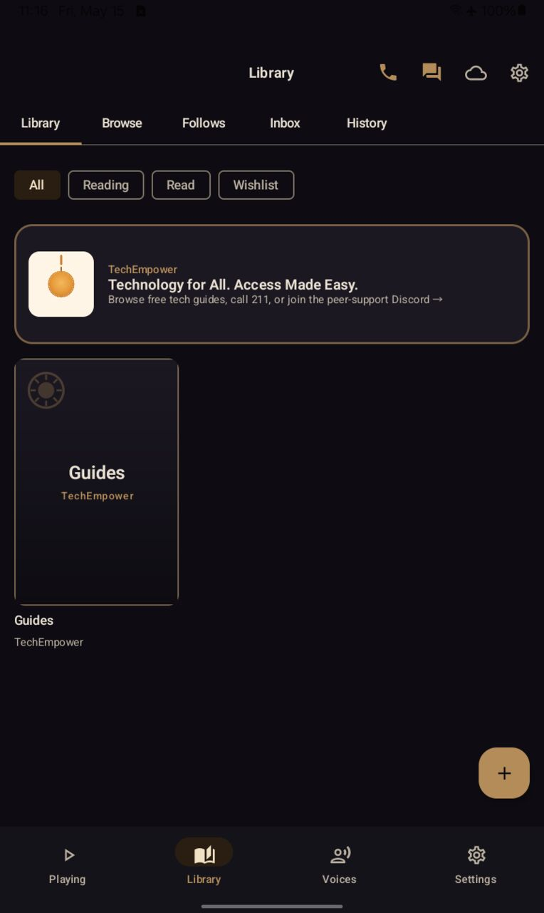
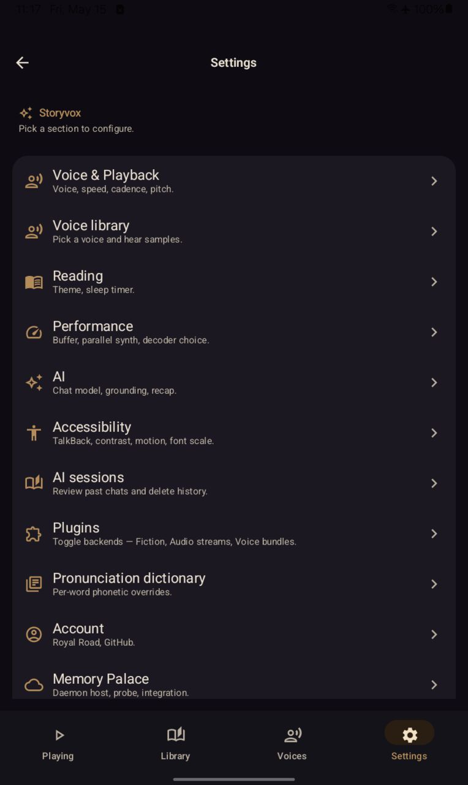

<section class="hero">
  

    <h1>storyvox</h1>
    
A neural-voice audiobook player for any text you have.

    

      Stream chapters from <a href="https://royalroad.com">Royal Road</a>,
      <a href="https://github.com/jphein/storyvox-registry">GitHub</a>, an
      <a href="https://www.getoutline.com">Outline</a> wiki, an RSS / Atom feed, a
      <a href="https://github.com/jphein/mempalace">Memory Palace</a> you host yourself,
      or a folder of EPUB files on your device — read aloud by an
      <strong>offline neural TTS engine</strong> (with optional Azure HD cloud voices),
      and a hybrid reader/audiobook view that highlights the spoken sentence as you listen.
    

    

      <a class="cta-primary" href="install/">Install</a>
      <a class="cta-secondary" href="https://github.com/jphein/storyvox">Source on GitHub</a>
    

  

  

    <dark-image
      src-dark="screenshots/03-reader.png"
      src-light="screenshots/03-reader-light.png"
      alt="storyvox reader playing The Archmage Coefficient with the spoken sentence highlighted in brass.">
      
    </dark-image>
  

</section>

<section class="why">
  <h2>Why storyvox</h2>
  

    

      <h3>Offline neural TTS</h3>
      

        Two voice families ship — <a href="https://github.com/rhasspy/piper">Piper</a> (compact, ~14–30 MB)
        and <a href="https://github.com/hexgrad/kokoro">Kokoro</a> (multi-speaker, ~330 MB).
        Voices download once, then live on-device. No cloud, no API keys, no per-character billing.
      

    

    

      <h3>Brass on warm dark</h3>
      

        Library Nocturne theme — brass accents, EB Garamond chapter body, Inter UI. Light mode is
        parchment cream. Adaptive grid for phones (2 col), tablets (5 col), and foldables.
      

    

    

      <h3>Six fiction sources</h3>
      

        Royal Road with the full filter set, GitHub fiction repos via the curated
        <a href="https://github.com/jphein/storyvox-registry">storyvox-registry</a>,
        any RSS / Atom feed (with a managed suggested-feeds list), a self-hosted
        <a href="https://www.getoutline.com">Outline</a> wiki, your own
        <a href="https://github.com/jphein/mempalace">Memory Palace</a>, or a folder of
        EPUB files on your device. Each backend has its own on/off toggle.
      

    

    

      <h3>Reader view, in sync</h3>
      

        Swipe between audiobook view (cover + scrubber + transport) and reader view (chapter text).
        The current sentence glides along in brass, matching the read-aloud rhythm.
      

    

    

      <h3>Smooth on slow hardware</h3>
      

        Tier 3 multi-engine parallel synthesis (1–8 VoxSherpa instances × N threads each,
        twin sliders in Settings → Performance), a producer pinned to <code>URGENT_AUDIO</code>,
        and PCM cache buffering keep playback gapless even when Piper-high struggles on a
        Helio P22T. Tuned on a Galaxy Tab A7 Lite.
      

    

    

      <h3>Optional cloud voices</h3>
      

        Bring your own Azure key for studio-grade <a href="https://learn.microsoft.com/azure/ai-services/speech-service/text-to-speech">Azure HD voices</a>.
        Offline fallback to your local voice if the network drops or your key expires.
        Opt-in, never required, never billed by storyvox.
      

    

    

      <h3>Free and open</h3>
      

        GPL-3.0. Inheritable from the TTS engine, but also a posture: no telemetry, no analytics,
        no upsell. Sideload the APK from <a href="https://github.com/jphein/storyvox/releases">Releases</a>
        and you're done.
      

    

  

</section>

<section class="screens">
  <h2>What it looks like</h2>
  
Galaxy Tab A7 Lite, 800×1340 px. <a href="screenshots/">Full gallery →</a>

  

    <figure>
      <dark-image src-dark="screenshots/01-browse.png" src-light="screenshots/01-browse-light.png" alt="Browse tab">
        
      </dark-image>
      <figcaption>Browse</figcaption>
    </figure>
    <figure>
      <dark-image src-dark="screenshots/02-detail.png" src-light="screenshots/02-detail-light.png" alt="Fiction detail">
        
      </dark-image>
      <figcaption>Fiction detail</figcaption>
    </figure>
    <figure>
      <dark-image src-dark="screenshots/04-library.png" src-light="screenshots/04-library-light.png" alt="Library tab">
        
      </dark-image>
      <figcaption>Library</figcaption>
    </figure>
    <figure>
      <dark-image src-dark="screenshots/05-settings.png" src-light="screenshots/05-settings-light.png" alt="Settings">
        
      </dark-image>
      <figcaption>Settings</figcaption>
    </figure>
  

</section>

<section class="recent">
  <h2>What just shipped</h2>
  

    <strong>v0.5.07</strong> — Library Nocturne UX milestone. Full brass-on-warm-dark
    polish pass across player, library, settings, and browse: TopAppBar nav across
    detail screens, single back-nav pattern, chapter rows tappable with played
    indicators, infinite-scroll Browse across every tab, brass spinners and progress
    bars everywhere, deliberate first-time defaults, and a confetti milestone dialog.
    <a href="https://github.com/jphein/storyvox/releases/tag/v0.5.07">Full release notes →</a>
  

  

    <strong>Earlier in v0.4:</strong> Tier 3 multi-engine parallel synthesis with twin
    Engines/Threads sliders (v0.4.78); smart-resume CTA (v0.4.83); Azure Cognitive Services HD voices as
    an optional remote TTS backend (BYOK, with offline fallback, error retries, full roster
    and cache eviction priority — <a href="https://github.com/jphein/storyvox/issues/182">#182</a>–<a href="https://github.com/jphein/storyvox/issues/186">#186</a>);
    EPUB import (<a href="https://github.com/jphein/storyvox/issues/235">#235</a>) via the
    Storage Access Framework + an OPF parser; RSS / Atom feeds
    (<a href="https://github.com/jphein/storyvox/issues/236">#236</a>) with a managed
    suggested-feeds list from <a href="https://github.com/jphein/storyvox-feeds">storyvox-feeds</a>;
    self-hosted Outline wikis as a backend
    (<a href="https://github.com/jphein/storyvox/issues/245">#245</a>); AI Sessions surface
    (<a href="https://github.com/jphein/storyvox/issues/218">#218</a>); read-aloud per AI
    assistant turn (<a href="https://github.com/jphein/storyvox/issues/214">#214</a>);
    per-voice speed and pitch defaults
    (<a href="https://github.com/jphein/storyvox/issues/195">#195</a>); and stable debug
    keystore for clean upgrades over older debug builds.
  

  

    See the <a href="https://github.com/jphein/storyvox/wiki">wiki</a> for build, voice catalog,
    and troubleshooting reference, or <a href="architecture/">how the modules fit together</a>.
  

</section>

<footer class="site-footer">
  

    storyvox is licensed under the
    <a href="https://github.com/jphein/storyvox/blob/main/LICENSE">GNU General Public License v3.0</a>.
    Built by <a href="https://github.com/jphein">JP Hein</a>
    with teams of <a href="https://www.anthropic.com/claude-code">Claude Code</a> agents.
  

</footer>
