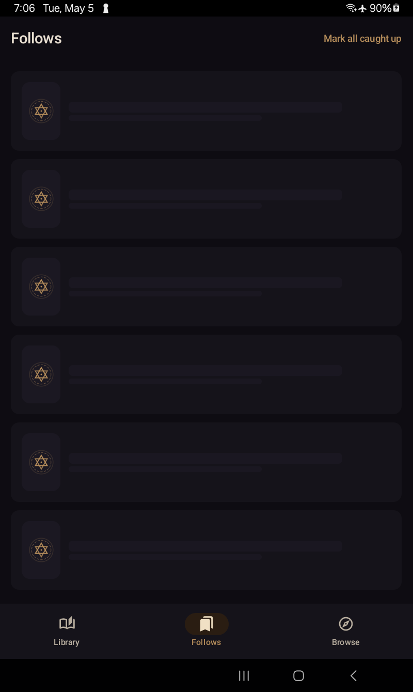
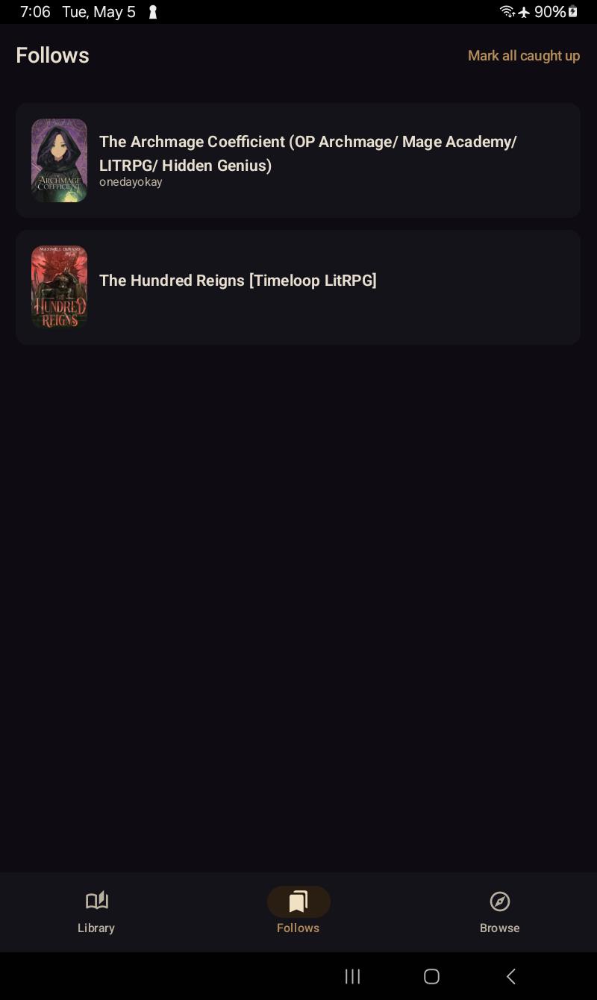

# Screenshots

Captured on a Galaxy Tab A7 Lite (800×1340 px) running storyvox in the Library Nocturne dark theme.

## Browse

<figure>
  
  <figcaption>Browse — Royal Road infinite-scroll grid with cover art and pinned source picker.</figcaption>
</figure>

## Filters

<figure>
  
  <figcaption>The full Royal Road filter set — tags include / exclude, status, type, length, rating, content warnings, sort order.</figcaption>
</figure>

## Fiction detail

<figure>
  
  <figcaption>Fiction detail — synopsis, tags, chapter list, follow / unfollow, jump to first unread.</figcaption>
</figure>

## Reader / audiobook view

<figure>
  
  <figcaption>Reader — the spoken sentence glides in brass as TTS plays. Swipe left for the audiobook view (cover, scrubber, transport controls).</figcaption>
</figure>

## Library

<figure>
  
  <figcaption>Library — currently-listening fictions with cover, progress, last-read sentence, resume button.</figcaption>
</figure>

## Settings

<figure>
  
  <figcaption>Settings — voice picker, speed, pitch, punctuation cadence, buffer slider, theme override, Wi-Fi-only, poll interval, account, version. (Settings UI is being redesigned in <a href="https://github.com/jphein/storyvox/issues/104">#104</a> — these screenshots reflect v0.4.x layout.)</figcaption>
</figure>

## Follows

<figure>
  
  <figcaption>Follows — sync in progress.</figcaption>
</figure>

<figure>
  
  <figcaption>Follows — bookmarked fictions, grid view, signed in.</figcaption>
</figure>
